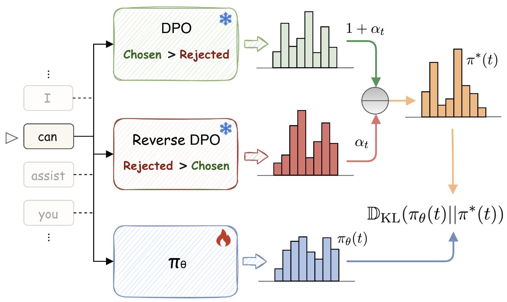

# AlignDistil
Code for ACL 2025 Paper "AlignDistil: Token-Level Language Model Alignment as Adaptive Policy Distillation"

Our code is based on [OpenRLHF](https://github.com/OpenRLHF/OpenRLHF) v0.5.2.post2.

## Method Framework
<div align="center">
    
</div>
<!--  -->

Our AlignDistil is easy to use, which contains three steps:
- Train a DPO model on your preferece data
- Train a reverse DPO model on your reversed preference data (swapping `chosen` and `rejected`)
- AlignDistil: Composing a synthetic distribution from these two models and distill it to the current policy model.
It could be on your preference data (off-policy) or model-sampled data (on-policy).

## Prepare
Please run the following commands to install the specific OpenRLHF in our repo:
```shell
git clone https://github.com/songmzhang/AlignDistil
cd AlignDistil/OpenRLHF
pip install -e ./
```
You also need to install vllm to run on-policy AlignDistil.

## Start
DPO training example:
```shell
bash ./train_scripts/ultrafeedback/qwen2.5-1.5b/dpo_01.sh
```

Reverse DPO training example:
```shell
bash ./train_scripts/ultrafeedback/qwen2.5-1.5b/reverse_dpo_01.sh
```

Off-policy AlignDistil training example:
```shell
bash ./train_scripts/ultrafeedback/qwen2.5-1.5b/aligndistil_off_policy.sh
```

On-policy AlignDistil training example:
```shell
bash ./train_scripts/ultrafeedback/qwen2.5-1.5b/aligndistil_on_policy.sh
```

## Citation
If you find this repo helpful, please cite:
```text
@article{zhang2025aligndistil,
  title={Aligndistil: Token-level language model alignment as adaptive policy distillation},
  author={Zhang, Songming and Zhang, Xue and Zhang, Tong and Hu, Bojie and Chen, Yufeng and Xu, Jinan},
  journal={arXiv preprint arXiv:2503.02832},
  year={2025}
}
```